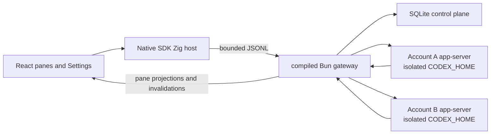

# HRA for macOS

HRA is a local-first macOS interface for long-running, parallel Codex work. Panes are repository-bound chats that can run independently. Settings manages local Codex subscriptions. HRA keeps the pane grid unavailable until at least one subscription is signed in.

HRA does not require a separate HRA account for local use. Each pane exposes the fixed Sol model, Ultra or Max reasoning, Standard or Fast speed when supported, current activity, and the latest assistant response. The gateway selects a healthy signed-in subscription before each turn and can continue a quota-exhausted turn on another subscription only after it proves a complete bounded handoff.

## Supported platform

- Apple Silicon running macOS 13 or newer
- Bun 1.3.14 for repository development
- Zig 0.16.0, Xcode Command Line Tools, and the macOS SDK for native builds

The desktop build pins the Codex and Git versions it was tested against. Apple Silicon is the only supported native target until another target has matching runtime pins and acceptance evidence.

## Architecture



- The Zig host owns application lifecycle, the system WKWebView, trusted directory selection, and the bounded Native bridge.
- The compiled Bun gateway owns SQLite, Codex and Git processes, account routing, local execution, recovery, and destructive-data authority.
- The renderer receives pathless projections and app-owned commands. It never receives provider thread IDs, raw protocol messages, local paths, credentials, commands, or tool output.
- Each account gets a separate `CODEX_HOME` and durable process generation. A generation advances before replacement, so stale responses cannot reach a newer process.
- The renderer hydrates one atomic snapshot and applies ordered events. A sequence gap or `snapshot.invalidated` event triggers a fresh snapshot.

The gateway also contains the recursive-session v2 graph described in [`HARNESS.md`](HARNESS.md). It adds a closed lexical RLM program, encrypted completed-prefix and current-input context, persistent recursive actors, durable receipts, and bounded recovery while keeping Codex as the only model and transcript runtime.

## Local state and account isolation

The current application-state root is:

```text
~/Library/Application Support/OPRTE/
  control-plane.sqlite
  codex/accounts/<profile-id>/
    home/
    runtime/
```

The `OPRTE` spelling is a retained on-disk compatibility identifier. Product copy and public commands use HRA.

Directories are checked for symlink escapes and repaired to user-only permissions. SQLite stores bounded HRA state such as profile labels, revisions, durable generations, pane state, receipts, and the text needed for the latest response and an explicit subscription handoff. Codex owns credentials, complete sessions, configuration, and logs inside each account home.

Removing a profile, deleting its local Codex data, and removing all HRA local data are separate operations. None of them deletes user repositories. Destructive flows require revision fences and exact confirmation; the shipping Panes and Settings interface does not expose whole-app removal.

## Local development

Install dependencies from the repository root:

```sh
bun install
```

Run the desktop development composition:

```sh
bun hra
```

`bun hra` builds an unminified gateway, incrementally compiles the Debug Zig host, starts Vite on `127.0.0.1:5173`, proves the listener with a fresh launch nonce, and opens the WKWebView application. React changes use HMR. Restart the command after changing Zig or gateway code.

For renderer-only browser development:

```sh
bun run --cwd apps/desktop dev:frontend
```

The browser process cannot spawn Codex, select arbitrary filesystem paths, or inherit account homes. Use the native development composition for work that needs those capabilities.

## Deterministic Direct workbench

Run the isolated browser workbench:

```sh
bun run --cwd apps/desktop dev:direct
```

Direct serves the real React application on `127.0.0.1:5174` with deterministic in-memory transports and scenario state. It covers settings-only startup, pane creation and ordering, reasoning and speed changes, streaming output, account routing, sign-in states, concurrent panes, and sequence-gap recovery. It opens no credentials, starts no gateway, and has no filesystem or deployment authority.

Use these focused checks:

```sh
bun run --cwd apps/desktop test:direct
bun run --cwd apps/desktop build:direct
bun run --cwd apps/desktop verify:direct
```

## Local-state maintenance

Stop HRA before running a maintenance command:

```sh
bun run --cwd apps/desktop state:doctor
bun run --cwd apps/desktop state:backup /absolute/new/backup.hra
bun run --cwd apps/desktop state:inspect /absolute/backup.hra
bun run --cwd apps/desktop state:verify /absolute/backup.hra
bun run --cwd apps/desktop state:restore /absolute/backup.hra
```

Backup and restore passphrases are accepted only through standard input. Backup creation is atomic and refuses to replace an existing archive. Inspection reads bounded header metadata; verification authenticates every archive byte before restore.

Backups contain the SQLite snapshot and its bound receipt key. They do not contain Keychain items, Codex account homes, full transcripts, managed worktrees, user repositories, or cloud session-sync ciphertext.

## Verification

Run portable desktop checks from the repository root:

```sh
bun run --cwd apps/desktop typecheck
bun run --cwd apps/desktop lint
bun run --cwd apps/desktop test
bun run --cwd apps/desktop test:property
bun run --cwd apps/desktop build
```

On an Apple Silicon Mac with the native toolchain:

```sh
bun run --cwd apps/desktop validate
bun run --cwd apps/desktop doctor:macos
bun run --cwd apps/desktop test:macos
bun run --cwd apps/desktop build:macos
```

`build:macos` is source-build evidence. This public workspace does not create, sign, notarize, or publish official consumer artifacts.

## Manual account-isolation smoke

Use throwaway repositories and two test Codex subscriptions. Do not record emails, OAuth URLs, device codes, tokens, prompts, approval answers, or local paths.

- Sign both subscriptions in and confirm one profile's authentication and budget state never changes the other.
- Run parallel turns and confirm each pane receives only its own bounded response and activity.
- Trigger deterministic quota, approval, stale-turn, duplicated-terminal, and interrupted-runtime fixtures. Confirm the affected pane fails closed without repainting another pane.
- Quit and reopen HRA. Confirm pane order, account selection, and distinct process generations recover without cross-profile prompts.
- Inspect diagnostics and SQLite. Confirm they contain no credentials, raw provider payloads, tool details, local paths, or full transcripts.
