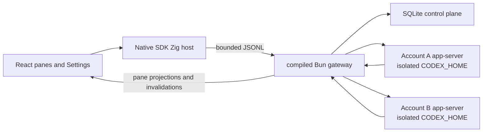

# HRA for macOS

HRA is a local-first macOS interface for long-running, parallel Codex work. Panes are repository-bound chats that can run independently. Settings manages local Codex subscriptions. HRA keeps the pane grid unavailable until at least one subscription is signed in.

HRA does not require a separate HRA account for local use. Each pane exposes the fixed Sol model, Ultra or Max reasoning, Standard or Fast speed when supported, current activity, and the latest assistant response. The gateway admits work only to an eligible signed-in subscription. A provider usage limit stops the affected work; HRA does not move that work to another subscription or use multiple subscriptions to circumvent provider limits.

## Supported platform

- Apple Silicon running macOS 13 or newer
- Bun 1.3.14 for repository development
- Zig 0.16.0, Xcode Command Line Tools, and the macOS SDK for native builds

The desktop build pins the Codex and Git versions it was tested against. Apple Silicon is the only supported native target until another target has matching runtime pins and acceptance evidence.

## Architecture



- The Zig host owns application lifecycle, the system WKWebView, trusted directory selection, and the bounded Native bridge.
- The compiled Bun gateway owns SQLite, Codex and Git processes, account routing, local execution, recovery, and destructive-data authority.
- The renderer receives pathless projections and app-owned commands. It never receives provider thread IDs, raw protocol messages, local paths, credentials, commands, or tool output.
- Each account gets a separate `CODEX_HOME` and durable process generation. A generation advances before replacement, so stale responses cannot reach a newer process.
- The renderer hydrates one atomic snapshot and applies ordered events. A sequence gap or `snapshot.invalidated` event triggers a fresh snapshot.

The gateway also contains the recursive-session v2 graph described in [`HARNESS.md`](HARNESS.md). It adds a closed lexical RLM program, encrypted completed-prefix and current-input context, persistent recursive actors, durable receipts, and bounded recovery while keeping Codex as the only model and transcript runtime.

## Local state and account isolation

The current application-state root is:

```text
~/Library/Application Support/OPRTE/
  control-plane.sqlite
  codex/accounts/<profile-id>/
    home/
    runtime/
```

The `OPRTE` spelling is a retained on-disk compatibility identifier. Product copy and public commands use HRA.

Directories are checked for symlink escapes and repaired to user-only permissions. SQLite stores bounded HRA state such as profile labels, revisions, durable generations, pane state, receipts, account-routing evidence, recovery evidence, and the text needed for the latest response. Codex owns credentials, complete sessions, configuration, and logs inside each account home.

Removing a profile, deleting its local Codex data, and removing all HRA local data are separate operations. None of them deletes user repositories. Destructive flows require revision fences and exact confirmation; the shipping Panes and Settings interface does not expose whole-app removal.

## Local development

Install dependencies from the repository root:

```sh
bun install
```

Run the desktop development composition:

```sh
bun hra
```

`bun hra` starts HRA's malleable development composition. It builds an unminified gateway, incrementally compiles the Debug Zig host, starts Vite on `127.0.0.1:5173`, proves the listener with a fresh launch nonce, and opens the real WKWebView application against your local HRA state. The window title and a small `DEV` control show what the latest source edit needs.

| Changed source | Development behavior |
| --- | --- |
| Renderer components, styles, and renderer-only utilities | Vite applies the edit live. React state is usually preserved; a changed hook or export shape may remount that component. |
| Instruction and delegation text in `runtime/src/harness/actor-instruction-policy-v1.json` | HRA validates the bounded data and compiles a source-mapped candidate in the background. When the runtime is idle, use the `DEV` control to apply it. Newly started recursive actors use the updated instruction policy. The TypeScript parser and every other runtime file remain cold. The old generation closes cleanly and the renderer rehydrates from durable state. A failed validation or build leaves the running generation untouched. |
| Other gateway code, shared renderer/gateway contracts, gateway boot and durable recovery, account/session/Codex process code, projection installation, SQLite and persisted-state code, migrations, key custody, destructive maintenance, security, and release boundaries | Stop and rerun `bun hra`. Runtime code is cold by default; only reviewed pure kernels enter the apply lane, so a candidate cannot change durable or external authority before it is adopted. |
| Zig, Objective-C, `app.zon`, or `build.zig` | Stop and rerun `bun hra` to rebuild and reopen the native application. |
| The Vite configuration, development supervisor, package manifests, lockfile, or patches | Stop and rerun `bun hra` because the development session itself changed. |
| Tests and documentation | No running process changes. Run the relevant check normally. |

Ask the checked classifier about any repository-relative path:

```sh
bun run --cwd apps/desktop dev:classify -- apps/desktop/runtime/src/harness/actor-instruction-policy-v1.json
```

The runtime apply action never uses crash recovery as a reload mechanism. It first asks the current gateway to seal new work and refuses while authoritative work is active. The compiled candidate remains in a content-addressed sibling file while Native starts and verifies the exact next generation. HRA adopts it as the stable development gateway only after that generation is ready and the renderer has read a fresh authoritative snapshot. Compiler errors, superseded builds, and unconfirmed generations cannot replace the stable executable.

For renderer-only browser development:

```sh
bun run --cwd apps/desktop dev:frontend
```

The browser process cannot spawn Codex, select arbitrary filesystem paths, or inherit account homes. Use the native development composition for work that needs those capabilities.

## Deterministic Direct workbench

Run the isolated browser workbench:

```sh
bun run --cwd apps/desktop dev:direct
```

Direct serves the real React application on `127.0.0.1:5174` with deterministic in-memory transports and scenario state. It covers settings-only startup, pane creation and ordering, reasoning and speed changes, streaming output, account routing, sign-in states, concurrent panes, and sequence-gap recovery. It opens no credentials, starts no gateway, and has no filesystem or deployment authority.

Use these focused checks:

```sh
bun run --cwd apps/desktop test:direct
bun run --cwd apps/desktop build:direct
bun run --cwd apps/desktop verify:direct
```

## Local-state maintenance

Stop HRA before running a maintenance command:

```sh
bun run --cwd apps/desktop state:doctor
bun run --cwd apps/desktop state:backup /absolute/new/backup.hra
bun run --cwd apps/desktop state:inspect /absolute/backup.hra
bun run --cwd apps/desktop state:verify /absolute/backup.hra
bun run --cwd apps/desktop state:restore /absolute/backup.hra
```

Backup and restore passphrases are accepted only through standard input. Backup creation is atomic and refuses to replace an existing archive. Inspection reads bounded header metadata; verification authenticates every archive byte before restore.

Backups contain the SQLite snapshot and its bound receipt key. They do not contain Keychain items, Codex account homes, full transcripts, managed worktrees, user repositories, or cloud session-sync ciphertext.

## Verification

Run portable desktop checks from the repository root:

```sh
bun run --cwd apps/desktop typecheck
bun run --cwd apps/desktop lint
bun run --cwd apps/desktop test
bun run --cwd apps/desktop test:property
bun run --cwd apps/desktop build
```

On an Apple Silicon Mac with the native toolchain:

```sh
bun run --cwd apps/desktop validate
bun run --cwd apps/desktop doctor:macos
bun run --cwd apps/desktop test:macos
bun run --cwd apps/desktop build:macos
bun run --cwd apps/desktop package:macos:adhoc
bun run --cwd apps/desktop package:macos
```

`build:macos` produces the ReleaseFast host and native helpers. `package:macos:adhoc` builds the self-contained app, stages the pinned Codex and Git runtimes with their notices, applies an inside-out ad-hoc signature, and creates the DMG and checksum without downloading release source archives. `package:macos` performs the full clean-tree release assembly and creates these artifacts:

```text
zig-out/release/macos/arm64/
  HRA-0.1.7-8-macos-arm64.dmg
  HRA-0.1.7-8-macos-arm64.dmg.sha256
  HRA-0.1.7-8-release-manifest.json
  bun-0d9b296af33f2b851fcbf4df3e9ec89751734ba4-source.tar.gz
  bun-webkit-5488984d20e0dbfe4be2c3ba8fb18eb81a5e0e8b-source.tar.gz
  git-67ad42147a7acc2af6074753ebd03d904476118f-source.tar.gz
  dugite-native-f49d0098409aa243de8b9162127025ab0bb07a88-source.tar.gz
```

The Bun archive is a deterministic complete-source bundle containing its pinned native build inputs, nested Git sources, Node headers, and locked `lol-html` Cargo closure. Patched WebKit and JavaScriptCore remain in their own archive because it is close to GitHub's 2 GiB asset limit. The Git and Dugite Native archives close the bundled Git source boundary. Full packaging requires network access and a clean source tree. CI uses `package:macos:adhoc` to verify the same compiler, runtime, and license pins, app, DMG, and checksum without downloading the large source archives.

The ad-hoc package proves bundle integrity but does not identify a registered Apple developer. macOS may require **Privacy & Security → Open Anyway** after download. It is not notarized, and automatic updates remain disabled. Developer ID signing, notarization, and publication require separately provisioned release credentials.

Verify an existing package without rebuilding it:

```sh
bun run --cwd apps/desktop verify:package:macos
bun run --cwd apps/desktop verify:package:macos:adhoc
```

The explicit launch smoke starts the packaged native executable and its bundled gateway for a bounded interval, verifies their pinned runtime identity through an owned temporary marker, and then terminates the exact process group. The smoke path does not initialize AppKit, WebKit, updater state, account profiles, or Keychain custody, and removes its private temporary root in `finally`:

```sh
bun run --cwd apps/desktop smoke:package:macos
```

## Manual account-isolation smoke

Use throwaway repositories and two test Codex subscriptions. Do not record emails, OAuth URLs, device codes, tokens, prompts, approval answers, or local paths.

- Sign both subscriptions in and confirm one profile's authentication and budget state never changes the other.
- Run parallel turns and confirm each pane receives only its own bounded response and activity.
- Trigger deterministic usage-limit, approval, stale-turn, duplicated-terminal, and interrupted-runtime fixtures. Confirm the affected pane stops without cross-subscription continuation or repainting another pane.
- Quit and reopen HRA. Confirm pane order, account selection, and distinct process generations recover without cross-profile prompts.
- Inspect diagnostics and SQLite. Confirm they contain no credentials, raw provider payloads, tool details, local paths, or full transcripts.
